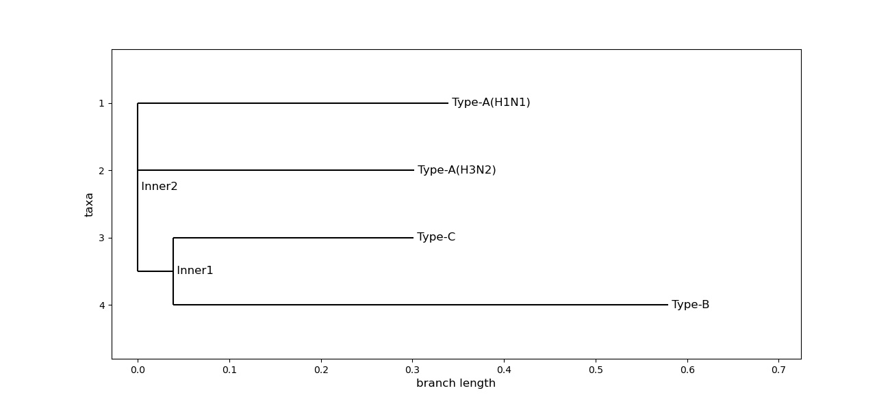

# Visualising Infectious Disease Surveillance Data for Public Health

## Dashboard

## Seasonality

## Phylogenetic Tree

## Forecasting

### Holt-Winters method [RMSE: 8002.02]

### Long short-term memory (LSTM) [RMSE: 6489.7]

### Facebook Prophet [RMSE: 5342.23]

### SARIMA(2, 1, 4)x(2, 0, 0, 52) [RMSE: 5303.06]

### SARIMAX(2, 1, 4)x(2, 0, 0, 52) [RMSE: 5350.34]

### Forecasting model selection

## Correlation with Temperature

## Simulation

