# Visualising Infectious Disease Surveillance Data for Public Health

Surveillance is essential to improve public health as the threat of infectious diseases continues to rise. The consequences of an uncontrolled spread of infections can disrupt a country’s economy and social system. It can result in a significant loss of human life, and it poses an unprecedented threat to people’s livelihood, public health and food systems (Chriscaden, 2020). Insights obtained from public health monitoring systems enable authorities to come to a timely resolution and act accordingly. Although the National Notifiable Disease Surveillance System (NNDSS) was established by the Australian Government for the sole purpose of coordinating the national surveillance on an agreed list of communicable diseases, it has limited functionality in terms of reporting such as the lack of any interactive visualizations or forecasting methods. This project aims to demonstrate a robust reporting system for public health using Influenza disease surveillance data sourced from the NNDSS website, as explained below.

## Data

The public health surveillance data is collected from Australia’s National Notifiable Disease Surveillance System (NNDSS) website for the “Influenza (laboratory confirmed)” (Flu). The data for Influenza is recorded from the year 2009 to 2019 which is in MS Excel format with a file size of 26498kB for Influenza and 1192kB for IPD (i.e., less than 30MB combined).
The specifications of the data are as follows. The influenza dataset contains six columns (or features) namely: Week Ending (Friday), State, Age group, Sex, Indigenous status, and Type/Subtype of the virus. The first column i.e., “Week Ending (Friday)” represents the date of the Friday, following the day that the notified case was diagnosed with Influenza. The “State” column represents the State or Territory which notifies NNDSS of the diagnosis. The included states are NSW, NT, Qld, SA, Tas, Vic, and WA. The age group is represented in years with the group of 5-year bins. The “Sex” column represents the gender of the individual i.e., “Male”, “Female”, “X”, and “Unknown”. The Indigenous status is represented as “Indigenous” (Aboriginal and/or Torres Strait Islander origin), “Non-Indigenous” (Not of Aboriginal or Torres Strait Islander origin), and “Unknown” (Not stated, unknown or blank). The last column denotes the type and subtype of the Influenza virus namely “A(H3N2)”, “A(H1N1)pmd09”, “A(H1N1)”, “A(unsubtyped)”, “B”, “C”, “A and B”, and “Untyped”.

There are three data caveats to be accounted for, that includes:

- The data from the Australia Capital Territory (ACT) are not included in the dataset for the flu.
- The recorded data is only for the cases that are diagnosed by health care professionals. Hence, there will be a degree of under-representation when compared with the true number of cases.
- It is crucial to note that variations in the number of cases over time don't always represent changes in disease prevalence or incidence. Other factors like changes in testing regulations, screening programmes, and public awareness may have an impact on the number of notifications received each year.

## Dashboard

I built an interactive dashboard using PowerBI that visualizes every attribute of the notified cases. As per my findings, children under the age of 15 years are the most affected age group which accounts for over 30% of the cases, Influenza-A virus is the dominant strain, and NSW is the most infected state in Australia.

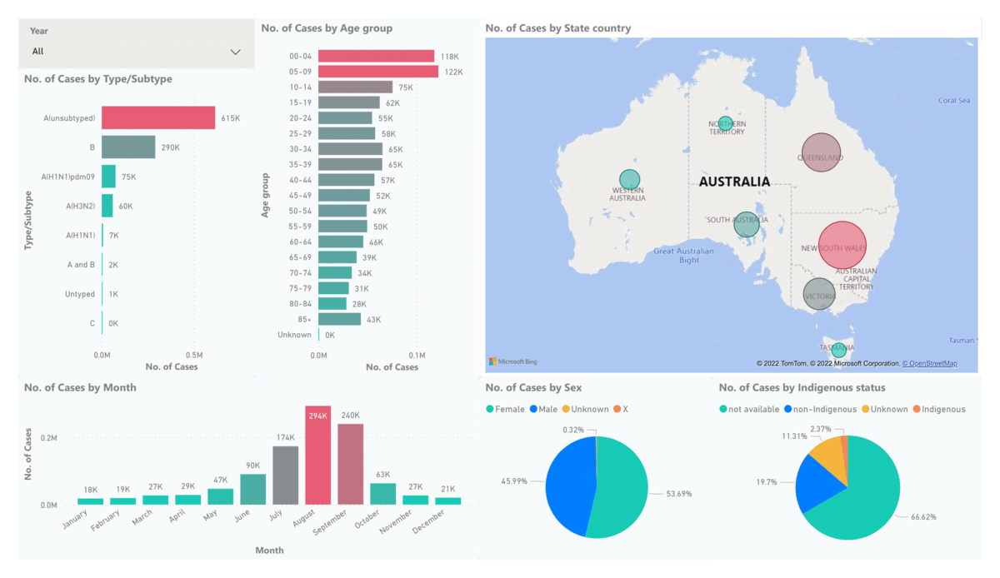

## Seasonality

I determined the seasonality of the flu to have a yearly seasonality that peaks every winter i.e., from June to September. This is determined by using the Error-Trend-Seasonality Model and Monthly Seasonality Plot.

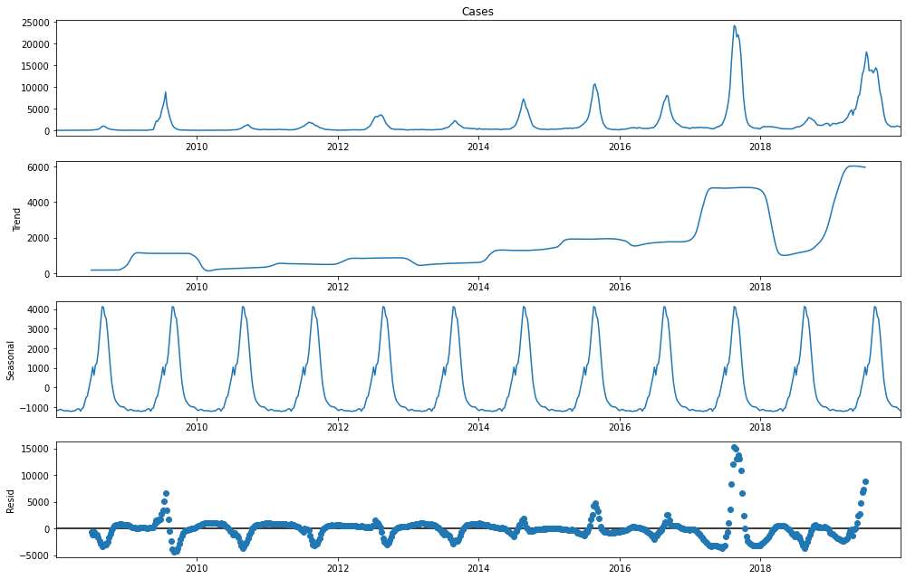

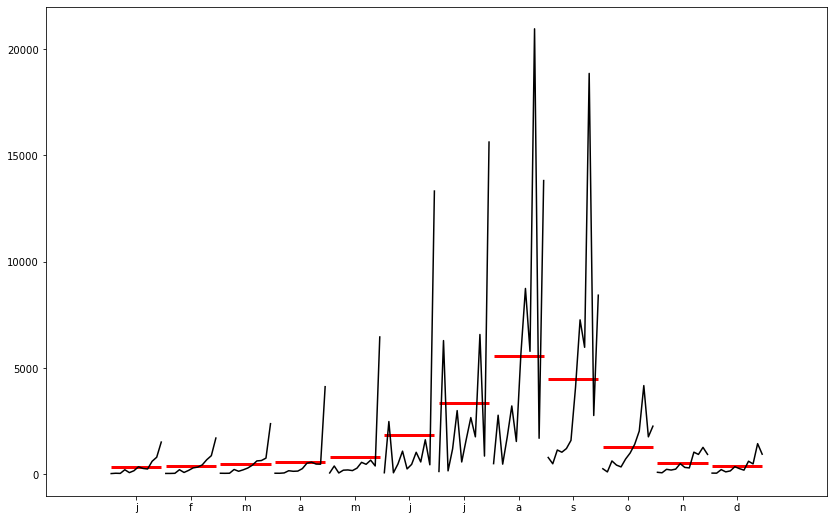

## Phylogenetic Tree

I constructed a Phylogenetic tree to visualize the evolution of the virus to be in the order of A(H1N1), B, C and A(H3N2) (Ludmir & Enquist, 2009).

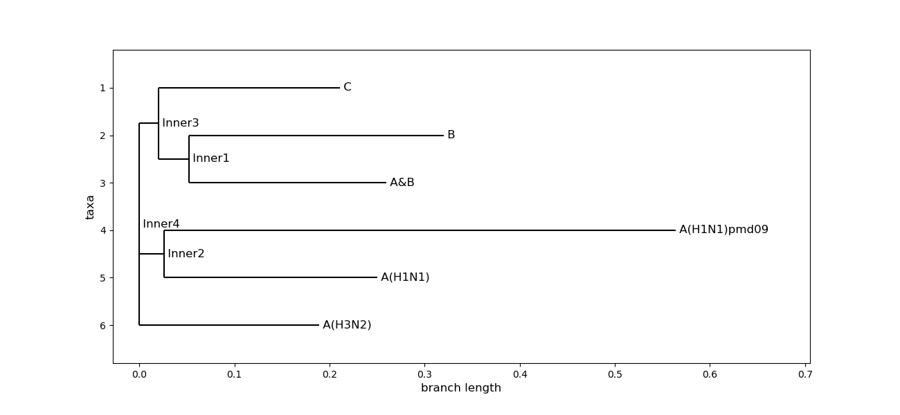

## Forecasting

I forecasted Influenza cases for 52 weeks by experimenting with the Holt-Winters method, LSTM, SARIMAX, Facebook Prophet, and SARIMA model.

### Holt-Winters method [RMSE: 8002.02]

The Holt-Winters forecasting method applies a triple exponential smoothing for level, trend and seasonal components. This model is defined by its three order parameters, alpha, beta, gamma. Alpha specifies the coefficient for the level smoothing. Beta specifies the coefficient for the trend smoothing. Gamma specifies the coefficient for the seasonal smoothing. There is also a parameter for the type of seasonality: Additive seasonality, where each season changes by a constant number. Multiplicative seasonality, where each season changes by a factor.

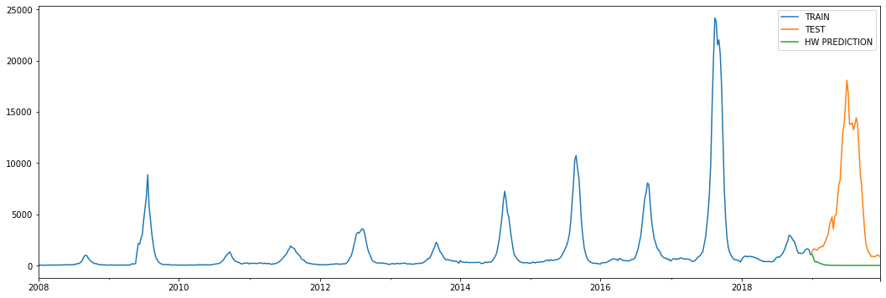

### Long short-term memory (LSTM) [RMSE: 7172.04]

Long Short Term Memory networks – usually just called “LSTMs” – are a special kind of RNN, capable of learning long-term dependencies. LSTMs are explicitly designed to avoid the long-term dependency problem. Remembering information for long periods of time is practically their default behavior, not something they struggle to learn!

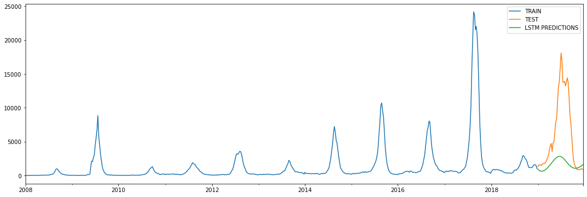

### Facebook Prophet [RMSE: 5342.23]

Prophet is an open source library published by Facebook that is based on decomposable (trend+seasonality+holidays) models. It provides us with the ability to make time series predictions with good accuracy using simple intuitive parameters and has support for including impact of custom seasonality and holidays!

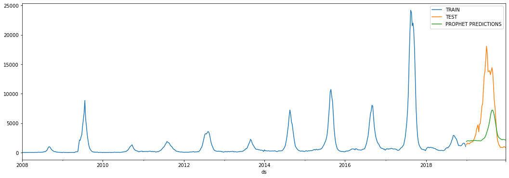

### SARIMA(2, 1, 4)x(2, 0, 0, 52) [RMSE: 5303.06]

Seasonal Autoregressive Integrated Moving Average, SARIMA or Seasonal ARIMA, is an extension of ARIMA that explicitly supports univariate time series data with a seasonal component. It adds three new hyperparameters to specify the autoregression (AR), differencing (I) and moving average (MA) for the seasonal component of the series, as well as an additional parameter for the period of the seasonality.

Configuring a SARIMA requires selecting hyperparameters for both the trend and seasonal elements of the series.

**Trend Elements**
There are three trend elements that require configuration:

- p: Trend autoregression order.
- d: Trend difference order.
- q: Trend moving average order.

**Seasonal Elements**
There are four seasonal elements that require configuration:

- P: Seasonal autoregressive order.
- D: Seasonal difference order.
- Q: Seasonal moving average order.
- m: The number of time steps for a single seasonal period.

Together, the notation for an SARIMA model is specified as:

> SARIMA(p, d, q)x(P, D, Q, m) => SARIMA(2, 1, 4)x(2, 0, 0, 52)

### SARIMAX(2, 1, 4)x(2, 0, 0, 52) [RMSE: 5350.34]

SARIMAX(Seasonal Auto-Regressive Integrated Moving Average with eXogenous factors) is an updated version of the ARIMA model. ARIMA includes an autoregressive integrated moving average, while SARIMAX includes seasonal effects and eXogenous factors (in this case, **temperature is the exogenous variable**) with the autoregressive and moving average component in the model.

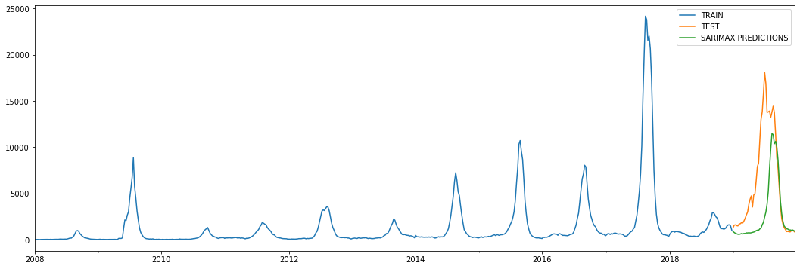

### Forecasting model selection

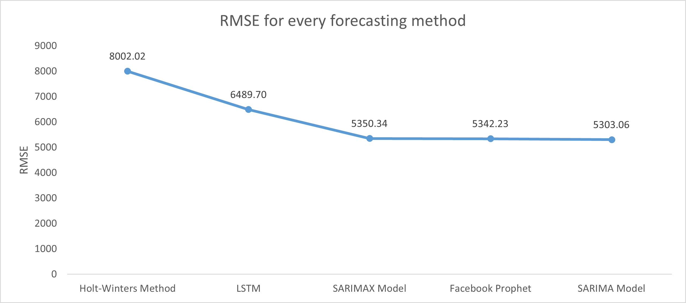

Root mean squared error (RMSE) is my prefered evaluation metric to determine the best forecasting model. Lower the RMSE value, better is the model performance. However, from the above plot we can see that the SARIMAX, Prophet, and SARIMA model all have almost the same RMSE value.

> Finally, I chose SARIMA as the preferred model because:
>
> - Prophet does not show a significant peak during the winter season.
> - SARIMAX requires an additional variable to enable prediction i.e., temperature as its exogenous variable. The actual temperature values for the future cannot be determined. The only way to use SARIMAX is to use predicted temperature values which itself may not be accurate.
> - SARIMA has the lowest RMSE value.

## Correlation with Temperature

> Correlation of Influenza Cases vs Temperature = -0.317;

Therefore, as the temperature decreases the number of flu infections tend to increase.

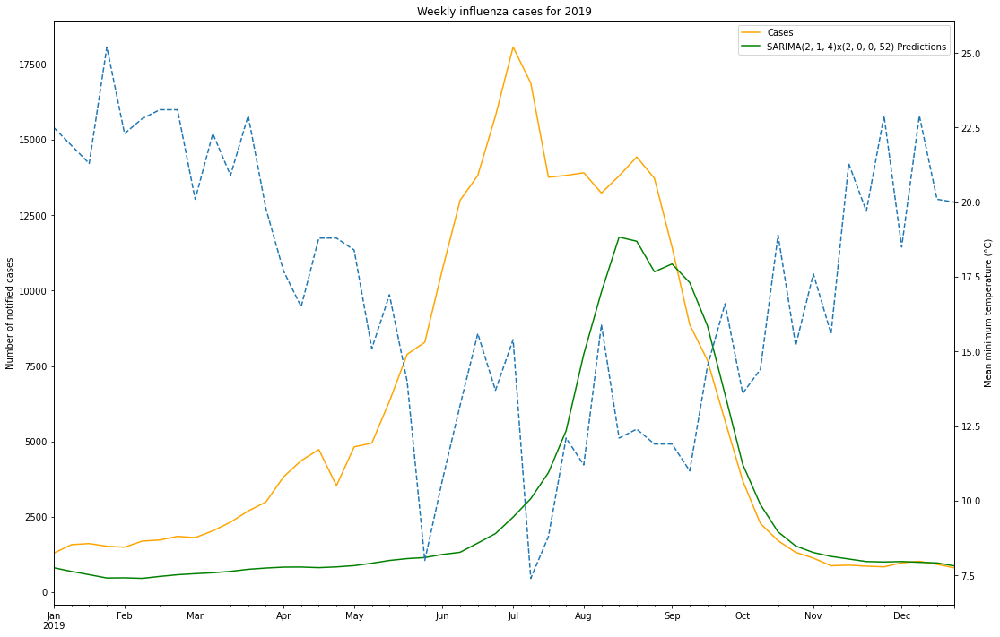

## Simulation

I simulated the influenza epidemic based on a deterministic **SEIR (Susceptible-Exposed-Infectious-Recovered)** model that visualizes the impact of preventive measures like wearing a mask and incorporating social distancing to help reduce the spread of infection (He, Peng, & Sun, 2020).

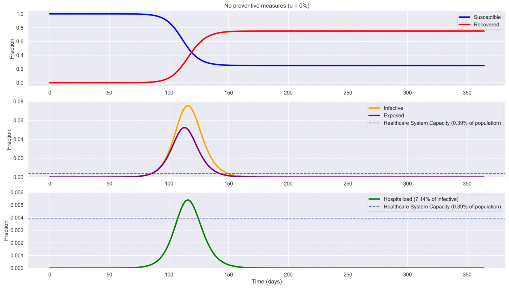

## Limitation

The only limitation of this project is that the dashboard is built on historical data. For the surveillance to be effective, the data should be analysed in near real-time. This can be accomplished by constructing data pipelines to extract, manipulate, and analyse data from the data source using Apache Beam and Python. Additionally, efforts should be made by the Australian government to create an API that streams national public health surveillance data to the population.

## Conclusion

To conclude, I see this project to be an effective public health reporting system that enables quick and informed decision making by the authorities thereby preventing yet another pandemic.

## References

- Chriscaden, K. (2020, October 13). Impact of covid-19 on people's livelihoods, their health and our Food Systems. Retrieved May 02, 2022, from https://www.who.int/news/item/13-10-2020-impact-of-covid-19-on-people's-livelihoods-their-health-and-our-food-systems
- He, S., Peng, Y., & Sun, K. (2020). Seir modeling of the COVID-19 and its dynamics. Nonlinear Dynamics, 101(3), 1667-1680. doi:10.1007/s11071-020-05743-y
- Ludmir, E. B., & Enquist, L. W. (2009). Viral genomes are part of the phylogenetic tree of life. Nature Reviews Microbiology, 7(8), 615-615. doi:10.1038/nrmicro2108-c4
